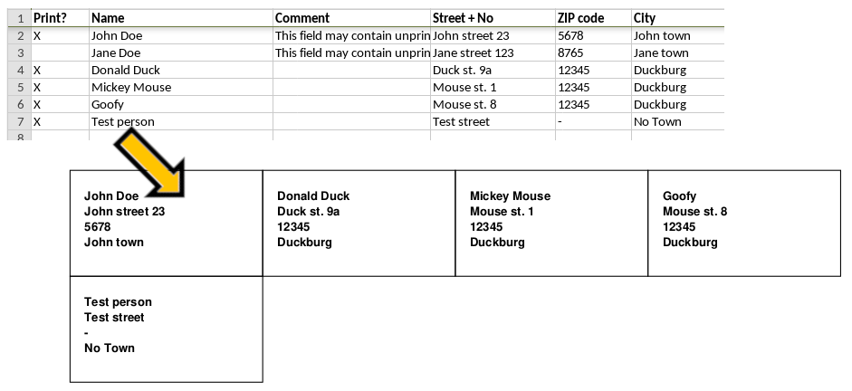

# excel-to-labels
Ever needed a bunch of addresses printed on a single page for print-out, cut and glue on letters? 

This repo offers exactly this functionality — first you enter all desired address fields into an Excel table, and then convert them into a PDF where each page holds multiple label cells. 



## Download and installation
Download the code using the following instructions:
```bash
cd ~/path/to/folder
git clone https://github.com/robvoe/excel-to-labels
```

Now, create the Conda environment to install necessary dependencies. This step requires [Conda](https://docs.conda.io/projects/conda/en/latest/user-guide/install/) to be installed.
```bash
cd ~/path/to/excel-to-labels
conda env create -f environment.yml 
```


## Usage
1) Copy and modify [template.xlsx](./template.xlsx) according to your needs.
2) Run the following code 

```bash
cd ~/path/to/excel-to-labels
conda activate excel-to-labels
python excel-to-labels.py  ~/path/to/excel/sheet.xlsx  ~/path/to/output.pdf
```